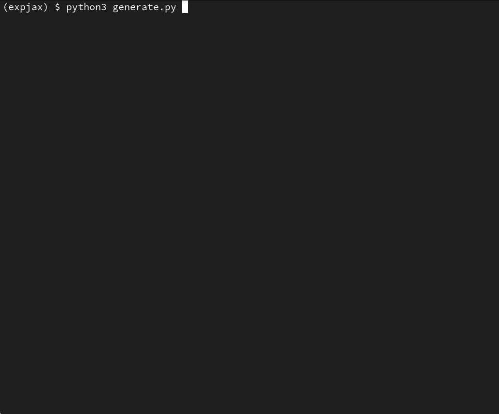

# minilm

A tiny transformer language model that learns to babble its own code.



## requirements

The program is written in Python using [`jax`](https://github.com/google/jax). It requires `regex` and `tqdm` for training.

## usage

The application consists of two trainable components: a tokenizer and the language model. The following code first trains a tokenizer, then trains a model, and then uses both to generate text.

```bash
python3 tokenizer.py
python3 train.py
python3 generate.py
```